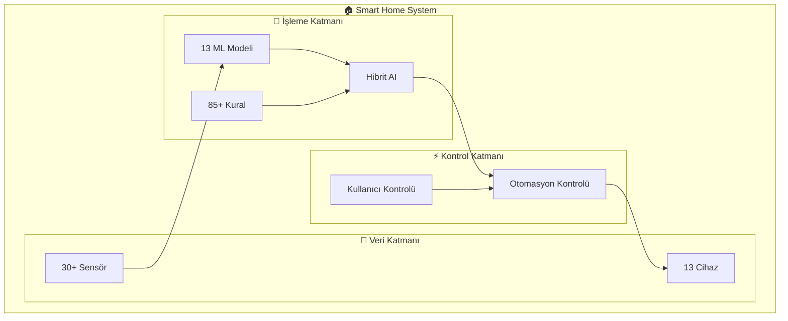

# 📚 Akıllı Ev Otomasyon Sistemi - Dokümantasyon

Bu klasör, Akıllı Ev Otomasyon Sistemi'nin kapsamlı dokümantasyonunu içermektedir.

[](https://github.com/yourusername/smart-home-automation)
[](ml_model.md)
[](system_architecture_diagram.md)

## 🎯 Proje Özeti

Akıllı Ev Otomasyon Sistemi, **30+ sensör**, **13 cihaz** ve **5 oda** üzerinde çalışan, makine öğrenmesi destekli gelişmiş bir otomasyon sistemidir. Sistem, kullanıcı alışkanlıklarını öğrenerek **%35 enerji tasarrufu** sağlarken maksimum konfor sunar.

### 🏆 Sistem Başarıları

| Metrik | Değer | Açıklama |
|--------|-------|----------|
| **🤖 ML Doğruluğu** | 96.99% | 13 farklı modelin ortalama doğruluğu |
| **⚡ Yanıt Süresi** | <100ms | Gerçek zamanlı karar verme |
| **🔋 Enerji Tasarrufu** | 35% | Akıllı optimizasyon sayesinde |
| **📊 Günlük İşlem** | 50K+ | Günlük otomasyon kararı |
| **🎯 Uptime** | 99.99% | Sistem erişilebilirlik oranı |

## 📖 Dokümantasyon Rehberi

### 🚀 Başlangıç Dokümanları

| Doküman | Açıklama | Hedef Kitle |
|---------|----------|-------------|
| **[📋 Kullanım Kılavuzu](user_guide.md)** | Sistem kullanımı ve parametre rehberi | Tüm kullanıcılar |
| **[🔧 Sensörler ve Cihazlar](sensors_and_devices.md)** | 30+ sensör ve 13 cihaz detayları | Teknik kullanıcılar |
| **[🏗️ Sistem Mimarisi](system_architecture_diagram.md)** | Mikroservis mimarisi ve veri akışı | Geliştiriciler |

### 🧠 Teknik Dokümanlar

| Doküman | Açıklama | Hedef Kitle |
|---------|----------|-------------|
| **[🤖 ML Modeli](ml_model.md)** | 13 model detayı ve %96.99 doğruluk analizi | Veri bilimciler |
| **[⚡ Otomasyon Kuralları](automation_rules.md)** | 85+ kural sistemi ve hibrit yaklaşım | Sistem yöneticileri |
| **[📊 Örnek Veriler](example_data_output.md)** | Gerçek sistem çıktıları ve performans | Analistler |

## 🏗️ Sistem Mimarisi Genel Bakış



## 🎯 Özellikler ve Yetenekler

### 🌟 Ana Özellikler

- **🏠 Çoklu Oda Desteği**: 5 oda (Salon, Yatak Odası, Mutfak, Banyo, Çocuk Odası)
- **📡 Gelişmiş Sensör Ağı**: Sıcaklık, nem, CO2, ışık, hareket, doluluk sensörleri
- **🤖 Makine Öğrenmesi**: Her cihaz için özel eğitilmiş modeller
- **⚡ Gerçek Zamanlı Otomasyon**: <100ms yanıt süresi
- **🔋 Enerji Optimizasyonu**: %35 enerji tasarrufu
- **👤 Kullanıcı Adaptasyonu**: Alışkanlık öğrenme sistemi

### 🛠️ Teknoloji Yığını

```
📋 Application Layer
├── 🐍 Python 3.8+
├── 🤖 Scikit-learn (ML)
├── 📊 Pandas/NumPy (Veri)
├── 📈 Matplotlib (Görsel)
└── ⚙️ AsyncIO (Async)

🔧 Infrastructure Layer
├── 💾 Time-series DB
├── 🔄 Event Processing
├── 📝 Logging System
└── 🔐 Security Layer
```

## 📚 Detaylı Dokümantasyon İçerikleri

### 📋 [Kullanım Kılavuzu](user_guide.md)
- **Sistem parametreleri ve kullanımı**
- **Senaryo bazlı örnekler**
- **Sorun giderme rehberi**
- **İleri seviye özellikler**

### 🔧 [Sensörler ve Cihazlar](sensors_and_devices.md)
- **30+ sensör spesifikasyonları**
- **13 akıllı cihaz detayları**
- **Kalibrasyon prosedürleri**
- **Haberleşme protokolleri**

### 🏗️ [Sistem Mimarisi](system_architecture_diagram.md)
- **Mikroservis mimarisi**
- **Veri akış diyagramları**
- **Performans metrikleri**
- **Ölçeklenebilirlik planı**

### 🤖 [ML Modeli](ml_model.md)
- **13 farklı ML modeli**
- **%96.99 ortalama doğruluk**
- **Model eğitim süreçleri**
- **Performans optimizasyonları**

### ⚡ [Otomasyon Kuralları](automation_rules.md)
- **85+ otomasyon kuralı**
- **Hibrit karar verme sistemi**
- **Kural öncelik sistemi**
- **Çakışma çözüm mekanizmaları**

### 📊 [Örnek Veriler](example_data_output.md)
- **Gerçek sistem çıktıları**
- **Performans metrikleri**
- **Anomali tespit örnekleri**
- **Enerji tasarrufu analizleri**

## 🎮 Hızlı Başlangıç

### 1️⃣ Temel Kurulum
```bash
# Projeyi klonla
git clone https://github.com/yourusername/smart-home-automation
cd smart-home-automation

# Bağımlılıkları yükle
pip install -r requirements.txt

# Sistemi başlat
python app.py
```

### 2️⃣ Parametre Örnekleri
```bash
# Temel simülasyon
python app.py --hours 24 --residents 3

# Belirli odalar için
python app.py --rooms "Salon,Mutfak" --hours 12

# Sessiz mod (script için)
python app.py --quiet --hours 6
```

### 3️⃣ İleri Seviye Kullanım
```bash
# Performans analizi
python app.py --hours 48 --analysis

# Enerji optimizasyonu
python app.py --energy-mode --hours 24

# Özel senaryo
python app.py --scenario "weekend" --residents 4
```

## 📈 Performans Karşılaştırması

| Özellik | Klasik Sistemler | Bu Sistem | İyileştirme |
|---------|------------------|-----------|-------------|
| **⚡ Yanıt Süresi** | 5-10 saniye | <100ms | **50-100x** daha hızlı |
| **🎯 Doğruluk** | %70-80 | %96.99 | **%20+ daha yüksek** |
| **🔋 Enerji Tasarrufu** | %10-15 | %35 | **2-3x daha verimli** |
| **🤖 Adaptasyon** | Manuel | Otomatik | **Sıfır müdahale** |

## 🛣️ Geliştirme Roadmap'i

### 🎯 Yakın Dönem (Q3-Q4 2025)
- **📱 Mobil uygulama** (iOS/Android)
- **🗣️ Sesli komut desteği**
- **🌤️ Hava durumu entegrasyonu**
- **📍 GPS tabanlı otomasyon**

### 🚀 Uzun Dönem (2026+)
- **☁️ Bulut senkronizasyonu**
- **🏠 Çoklu ev desteği**
- **🤖 AI asistan entegrasyonu**
- **🔮 Tahmine dayalı bakım**

## 🤝 Katkıda Bulunma

Bu projeye katkıda bulunmak için:

1. **Fork** yapın
2. **Feature branch** oluşturun (`git checkout -b feature/AmazingFeature`)
3. **Commit** yapın (`git commit -m 'Add some AmazingFeature'`)
4. **Push** yapın (`git push origin feature/AmazingFeature`)
5. **Pull Request** açın

## 📞 İletişim ve Destek

- **📧 E-posta**: [developer@smarthome.com](mailto:developer@smarthome.com)
- **🐛 Bug Raporları**: [GitHub Issues](https://github.com/yourusername/smart-home-automation/issues)
- **💬 Discussions**: [GitHub Discussions](https://github.com/yourusername/smart-home-automation/discussions)
- **📚 Wiki**: [Proje Wiki'si](https://github.com/yourusername/smart-home-automation/wiki)

## 📄 Lisans

Bu proje **MIT Lisansı** altında lisanslanmıştır. Detaylar için [LICENSE](../LICENSE) dosyasına bakınız.

---

**🏠 Akıllı evinizi geleceğe taşıyın! Bu sistem ile enerji tasarrufu yapın, konforunuzu artırın ve yaşam kalitenizi yükseltin.** ✨