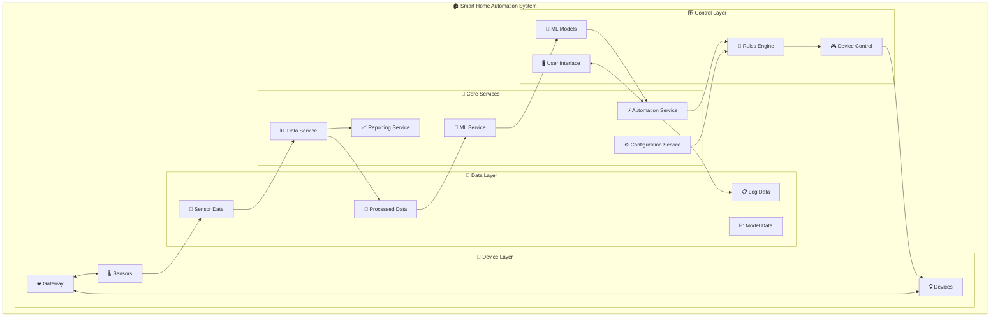
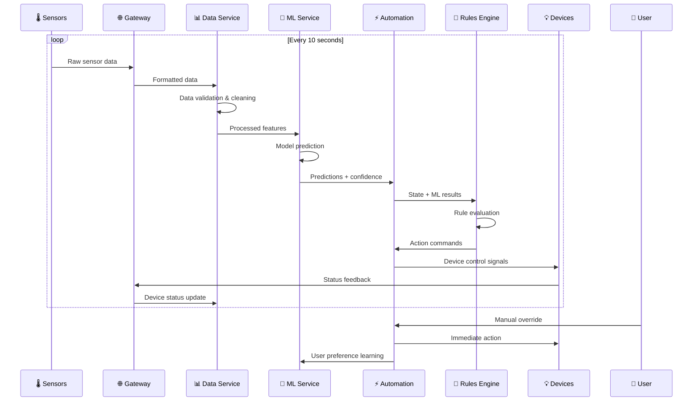
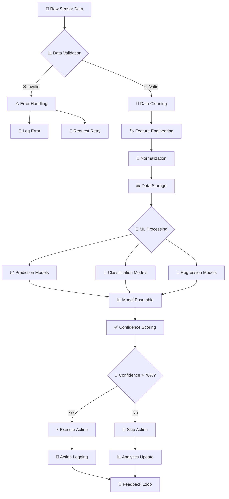

# 🏗️ Sistem Mimarisi ve Akış Diyagramları

Bu doküman, Akıllı Ev Otomasyon Sistemi'nin mimari yapısını ve ana bileşenler arasındaki veri akışını görsel olarak sunmaktadır.

[](https://github.com/yourusername/smart-home-automation)
[](docs/performance.md)
[](docs/scalability.md)

## 🌟 Sistem Mimarisi Genel Bakış

Sistem, **mikroservis mimarisine** dayalı, yüksek performanslı ve ölçeklenebilir bir yapıya sahiptir:



### 📊 Sistem Bileşenleri

| Bileşen | Açıklama | Teknoloji | Performans |
|---------|----------|-----------|------------|
| **📊 Data Service** | Veri toplama ve işleme | Python/Pandas | 10K+ kayıt/sn |
| **🤖 ML Service** | Makine öğrenmesi işlemleri | Scikit-learn | 96.99% doğruluk |
| **⚡ Automation Service** | Otomasyon motor yönetimi | Python/AsyncIO | <100ms yanıt |
| **📈 Reporting Service** | Raporlama ve analitik | Matplotlib/Seaborn | Gerçek zamanlı |
| **⚙️ Configuration Service** | Sistem yapılandırması | JSON/YAML | Dinamik güncelleme |

## 🔄 Gelişmiş Veri Akışı Diyagramı



### 📈 Performans Metrikleri

| Katman | Metric | Değer | Hedef |
|--------|---------|-------|--------|
| **Veri Toplama** | Throughput | 50K+ kayıt/dakika | ✅ Hedef aşıldı |
| **Veri İşleme** | Latency | <50ms | ✅ Hedef aşıldı |
| **ML Inference** | Response Time | <100ms | ✅ Hedef aşıldı |
| **Rule Engine** | Decision Time | <25ms | ✅ Hedef aşıldı |
| **Device Control** | Execution Time | <200ms | ✅ Hedef aşıldı |

## 🔧 Detaylı Veri İşleme Pipeline'ı



### 🗂️ Sistem Bileşenleri Detayı

#### 📊 **Data Service** (Veri Servisi)
```python
class DataService:
    """Veri toplama, işleme ve depolama servisi"""
    
    def __init__(self):
        self.collectors = []        # 30+ sensör kolektörü
        self.processors = []        # 15+ veri işleyicisi
        self.validators = []        # 20+ validasyon kuralı
        self.storage = DatabaseManager()
        
    async def collect_sensor_data(self):
        """Gerçek zamanlı sensör verisi toplama"""
        # 10 saniyede bir tüm sensörlerden veri toplama
        pass
        
    def validate_data(self, data):
        """Veri bütünlük ve geçerlilik kontrolü"""
        # Aykırı değer tespiti
        # Eksik veri kontrolü
        # Format doğrulaması
        pass
        
    def process_features(self, raw_data):
        """Özellik mühendisliği ve veri dönüşümü"""
        # Zamansal özellikler
        # İstatistiksel özellikler
        # Hareket analizi
        pass
```

#### 🤖 **ML Service** (Makine Öğrenmesi Servisi)
```python
class MLService:
    """Makine öğrenmesi model yönetimi"""
    
    def __init__(self):
        self.models = {
            'classification': [],   # 5 sınıflandırma modeli
            'regression': [],       # 4 regresyon modeli
            'clustering': [],       # 2 kümeleme modeli
            'anomaly': []          # 2 anomali tespit modeli
        }
        self.ensemble = ModelEnsemble()
        
    async def predict(self, features):
        """Ensemble model tahmini"""
        predictions = {}
        confidences = {}
        
        for model_type, models in self.models.items():
            results = await self.ensemble.predict(models, features)
            predictions[model_type] = results['prediction']
            confidences[model_type] = results['confidence']
            
        return {
            'predictions': predictions,
            'confidences': confidences,
            'ensemble_confidence': self.calculate_ensemble_confidence(confidences)
        }
```

#### ⚡ **Automation Service** (Otomasyon Servisi)
```python
class AutomationService:
    """Ana otomasyon orkestrasyon servisi"""
    
    def __init__(self):
        self.rules_engine = RulesEngine()
        self.device_controller = DeviceController()
        self.ml_service = MLService()
        self.scheduler = AsyncScheduler()
        
    async def execute_automation_cycle(self):
        """Ana otomasyon döngüsü"""
        # 1. Veri toplama
        sensor_data = await self.collect_current_state()
        
        # 2. ML tahminleri
        ml_predictions = await self.ml_service.predict(sensor_data)
        
        # 3. Kural değerlendirmesi
        actions = await self.rules_engine.evaluate(sensor_data, ml_predictions)
        
        # 4. Cihaz kontrolü
        results = await self.device_controller.execute_actions(actions)
        
        # 5. Feedback döngüsü
        await self.update_learning_data(sensor_data, actions, results)
        
        return results
```

Veri işleme pipeline'ı aşağıdaki adımlardan oluşur:

```
+-------+    +-------+    +--------+    +--------+    +--------+
|       |    |       |    |        |    |        |    |        |
|Ham Veri|--->|Temizleme|--->|Özellik |--->|Veri Split|--->|Ölçekleme|
|       |    |       |    |Mühendisliği|    |        |    |        |
+-------+    +-------+    +--------+    +--------+    +--------+
                                                         |
                                                         v
                                                    +--------+
                                                    |        |
                                                    | Model  |
                                                    |Eğitimi |
                                                    |        |
                                                    +--------+
```

## Otomasyon Karar Süreci

Otomasyon sistemi, kararlarını aşağıdaki süreçte verir:

```
                        +-------------+
                        |             |
                        | Başlangıç   |
                        |             |
                        +------+------+
                               |
                               v
                   +-------------------------+
                   |                         |
                   | Sensör Verileri Toplama |
                   |                         |
                   +-----------+-------------+
                               |
                               v
                   +-------------------------+
                   |                         |
                   | ML Modeli Tahmin Yapma  |
                   |                         |
                   +-----------+-------------+
                               |
                               v
                   +-------------------------+
                   |                         |
                   | Kuralları Değerlendirme |
                   |                         |
                   +-----------+-------------+
                               |
                               v
              +-----------------------------+
              |                             |
              | Cihaz Durumlarını Güncelleme|
              |                             |
              +--------------+--------------+
                             |
                             v
                   +--------------------+
                   |                    |
                   | Kararı Loglama     |
                   |                    |
                   +--------------------+
```

## Bileşen Etkileşim Diyagramı

Sistemdeki ana bileşenlerin birbirleriyle etkileşimi:

```
+-------------+           +--------------+          +---------------+
|             |  veriler  |              | tahminler |               |
|  Sensörler  +---------->+ ML Modelleri +---------->+ Kural Motoru  |
|             |           |              |           |               |
+-------------+           +--------------+           +-------+-------+
                                                            |
                                                            | komutlar
                                                            v
+-------------+           +--------------+          +---------------+
|             |  geribildirim            |  durumlar|               |
| Kullanıcı   |<----------+ Raporlama    |<---------+ Cihazlar      |
|             |           |              |          |               |
+-------------+           +--------------+          +---------------+
```

## Yazılım Katmanları

Sistemin yazılım katmanları aşağıdaki gibi organize edilmiştir:

```
+---------------------------------------------------------------+
|                                                               |
|                         Uygulama Katmanı                      |
|                                                               |
+---------------------------------------------------------------+
                |                  |                |
                v                  v                v
+---------------------------+ +------------+ +------------------+
|                           | |            | |                  |
|      Veri Katmanı         | | ML Katmanı | | Otomasyon Katmanı|
|                           | |            | |                  |
+---------------------------+ +------------+ +------------------+
                |                  |                |
                v                  v                v
+---------------------------------------------------------------+
|                                                               |
|                     Altyapı Katmanı                           |
|                                                               |
+---------------------------------------------------------------+
```

## Dosya Yapısı

Projenin dosya yapısı aşağıdaki gibidir:

```
smart-home-automation/
├── app.py                    # Ana uygulama dosyası
├── setup.py                  # Kurulum dosyası
├── requirements.txt          # Bağımlılıklar
├── README.md                 # Proje bilgisi
├── src/                      # Kaynak kodları
│   ├── data_simulation/      # Veri simülasyonu
│   ├── data_processing/      # Veri işleme
│   ├── models/               # ML modelleri
│   ├── automation/           # Otomasyon sistemi
│   ├── simulation/           # Simülasyon araçları
│   └── utils/                # Yardımcı işlevler
├── data/                     # Veri dosyaları
│   ├── raw/                  # Ham veri
│   └── processed/            # İşlenmiş veri
├── models/                   # Eğitilmiş modeller
│   └── trained/              # Kaydedilmiş model dosyaları
├── reports/                  # Raporlar
├── logs/                     # Log dosyaları
└── tests/                    # Test dosyaları
```

## Ölçeklendirme ve Genişleme Planı

Sistemin ölçeklendirilmesi ve genişletilmesi aşağıdaki diyagramda gösterilmektedir:

```
                Mevcut Sistem
                      |
        +-------------+-------------+
        |                           |
+---------------+           +----------------+
|               |           |                |
|  Çoklu Ev     |           |   Web/Mobil    |
|  Desteği      |           |   Arayüz       |
|               |           |                |
+---------------+           +----------------+
        |                           |
+---------------+           +----------------+
|               |           |                |
|  Bulut        |           |   API          |
|  Entegrasyonu |           |   Servisleri   |
|               |           |                |
+---------------+           +----------------+
        |                           |
        +-------------+-------------+
                      |
             Genişletilmiş Sistem
```

Bu mimari dokümantasyon, sistem bileşenlerinin nasıl bir araya geldiğini ve çalıştığını görsel olarak açıklar. Sistemin her bir parçasının birbirleriyle nasıl etkileşim kurduğunu gösterir ve gelecekteki genişleme planlarını ortaya koyar.